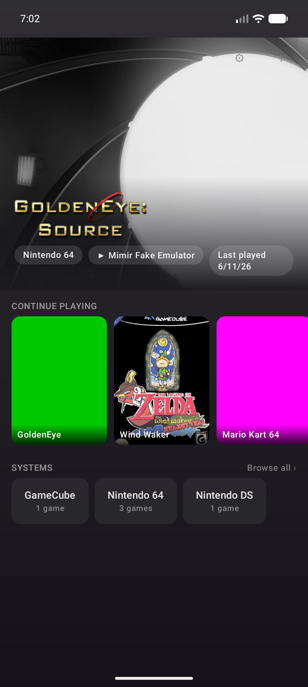
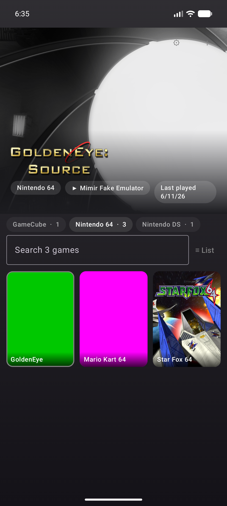
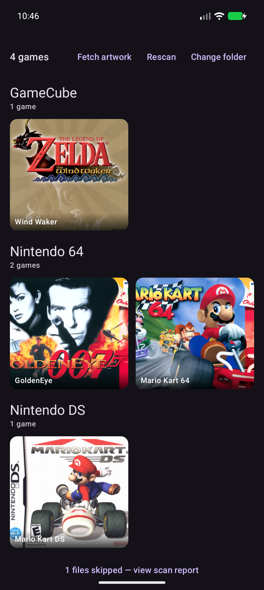

<div align="center">

# Mimir

**The open-source launcher your handheld deserves.**

A dual-screen-first emulation frontend for Android gaming handhelds — built for the
AYN Thor, beautiful on anything. Your library becomes a console: full-bleed hero art,
a continue-playing shelf, and an interface that re-paints itself in the colors of
whatever game you're looking at.

*Any emulator. Any art. Any theme. No accounts, no whitelists, no lock-in — and it
can never be abandoned, because the code is yours too.*

[](LICENSE)


> ### 🚧 Beta testing in progress
> Mimir is in **active beta**. Everything below works today on any single-screen
> Android device (phones, Odin, Retroid…). The dual-screen deck for the AYN Thor is
> built but **awaiting validation on real hardware (ETA July 2026)** — until then,
> consider Thor dual-screen support *coming, not shipped*. Found a bug?
> [Open an issue](../../issues) — beta feedback shapes 1.0.

  

</div>

---

## Why Mimir?

- 🎨 **Ambient Glass UI** — no fixed color scheme. Mimir extracts a palette from the
  focused game's artwork and washes the whole interface with it, live. Select Wind
  Waker and the screen breathes sea-green; select F-Zero and it ignites.
- 🕹️ **Any emulator, period.** Per-system defaults, per-game overrides (long-press any
  game), and an open registry — if your emulator isn't known, register *any installed
  app* as one in 30 seconds. An emulator renaming itself will never strand your library.
- 🖼️ **Art with zero hazing.** Boxart appears automatically with **no accounts and no
  API keys** (libretro-thumbnails). Drop your own PNG next to a ROM and it wins
  instantly. Import a whole scraped ES-DE library in one tap. Add a free SteamGridDB
  key for heroes and logos.
- 📚 **Built for real libraries.** Forgiving folder matching (`GameCube` = `gc` = `ngc`,
  any casing), a scan report that tells you *why* any file was skipped, and a browse
  screen that scales — system tabs, search, grid/list toggle, and an alphabet rail
  that jumps 3,000 ROMs in one swipe.
- ▶️ **Continue playing.** Mimir boots to the games you actually play, with playtime
  tracked locally. One tap and you're back in.
- 🔊 **Feels like a console.** Subtle navigation sounds and haptics, all themeable,
  all optional.
- 🧩 **Mix-and-match themes.** Every theme slot — palette, wallpapers, sounds, haptics,
  tile style — is independently overridable. Combine packs to get exactly your look.
- 💾 **Your data is yours.** One-tap backup of your art, emulator choices, playtime,
  and theme to a zip. Updates never eat your setup — and neither can we.
- 🆓 **GPLv3, free forever.** No paid tiers, no ads, no telemetry.

## Install

1. Download the latest `mimir.apk` from **[Releases](../../releases)**.
2. Sideload it (`adb install mimir.apk`, or open the APK from your file manager —
   allow "install unknown apps" if prompted).
3. Open Mimir → **Choose ROM folder** → point it at your ROMs. Boxart downloads
   automatically; no setup needed.
4. Optional, in **Settings**:
   - **Emulators** — pick per-system defaults, or add any app as a custom emulator.
   - **Art sources** — paste a free [SteamGridDB API key](https://www.steamgriddb.com/profile/preferences/api)
     for hero art and logos.
   - **Import ES-DE** (overflow menu) — migrating from ES-DE? Inherit your whole
     scraped media library in seconds.

ROM folders just work if they're named anything sensible (`n64`, `Nintendo 64`,
`GameCube`, `gc`…). Mixed layouts, ES-DE layouts, and Daijisho layouts all scan.

## Mimir vs. Cocoon

[Cocoon](https://cocoon-shell.com) is a genuinely lovely launcher and the reason this
project exists. Mimir is for people who want the same dual-screen-first ambition with
a different philosophy:

| | **Mimir** | **Cocoon** |
|---|---|---|
| Source | **GPLv3 — fork it, fix it, outlive it** | Closed (source promised only if abandoned) |
| Emulator support | Open registry **+ add any app yourself** | Curated list only |
| Library scanning | Any folder naming, alias dictionary, skip diagnostics | Exact lowercase folder names |
| Boxart with zero accounts | **Yes** (libretro-thumbnails) | No (ScreenScraper account required) |
| Your own art files | **Auto-detected next to ROMs** | Manual per-game |
| ES-DE migration | One-tap media import | Partial |
| Big libraries (1,000+ ROMs) | Tabs + search + list view + alphabet rail | Grid + folders |
| Backup | One-tap export | — |
| Aesthetic | Ambient Glass (your games color the UI) | 3DS homage |
| Theme mixing | Per-slot, built-in | Yes (Silk Pod store) |
| Theme store | Not yet | **Yes — Silk Pod** |
| Dual-screen today | Single-screen now; **dual-screen lands with M5b** | **Yes, shipping now** |
| Maturity | Beta, weeks old | Beta, months of polish |

If Cocoon already makes you happy, keep it — it's great. Mimir exists so this
category has an option that can't disappear.

## Support the project

Mimir is free and always will be. If it made your handheld better:

- ⭐ **Star this repo** — it genuinely helps people find it
- ☕ **[Buy me a coffee](#)** <!-- TODO: Ko-Fi/BMAC link -->
- 💜 **[GitHub Sponsors](#)** <!-- TODO: enable Sponsors -->
- 🧩 **Contribute** — adding an emulator or system to the JSON registries in
  `core/*/src/main/resources/` is a 5-line PR and helps everyone

## Build from source

Android SDK 36 required; the Gradle daemon JVM (21) auto-provisions via the
committed toolchain config.

```sh
./gradlew :app:assembleDebug        # the launcher APK
./gradlew test                      # 84 unit tests across 5 modules
./gradlew :tools:fake-emulator:assembleDebug   # intent-catching test fixture
```

| Module | What it is |
|---|---|
| `:app` | Android shell — Compose UI, SAF scanning, launching |
| `:core:scanner` | Pure JVM — platform registry + file→platform matcher |
| `:core:launcher` | Pure JVM — emulator registry + intent templates |
| `:core:scraper` | Pure JVM — libretro/SGDB/ES-DE/folder art matching |
| `:core:data` | Room persistence, diff-sync, art priority |
| `:core:theme` | Theme tokens, ambient palette engine |
| `:tools:fake-emulator` | Test APK that displays any launch intent it receives |

## Roadmap

- **M5b — dual-screen deck** *(next)*: hero canvas on the top screen, touch navigation
  on the bottom — the full AYN Thor experience, with a labeled screen-swap control.
- Video snaps (ScreenScraper, sign in with your own free account), backup restore,
  theme pack sharing, RetroArch core selection, arcade DAT naming.

## Credits

Designed and built by **[Jordan Stambaugh](https://github.com/jstamb)** ·
**[Stambaugh Designs](https://stambaughdesigns.co)**

Standing on excellent shoulders: [libretro-thumbnails](https://github.com/libretro-thumbnails/libretro-thumbnails)
(community boxart), [SteamGridDB](https://www.steamgriddb.com) (heroes & logos),
[Coil](https://coil-kt.github.io/coil/), [Room](https://developer.android.com/jetpack/androidx/releases/room),
and the AYN Thor community whose candid feedback shaped every feature.
Inspired by the bar Cocoon set for dual-screen launchers.

## License

[GPLv3](LICENSE) — free as in freedom. Mimir can outlive its maintainer, and that's
the point.
